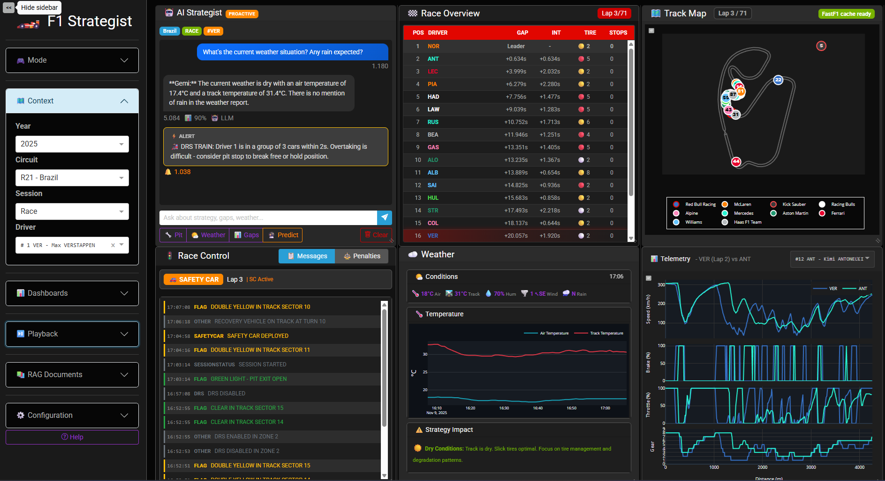
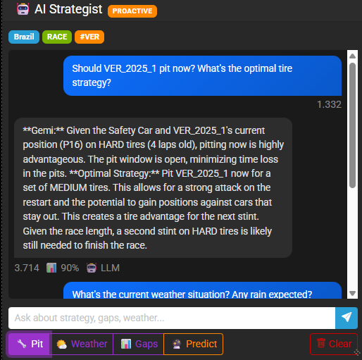
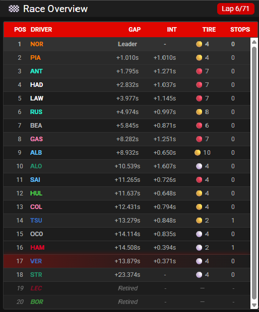
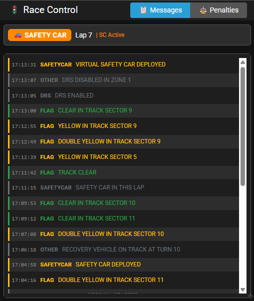
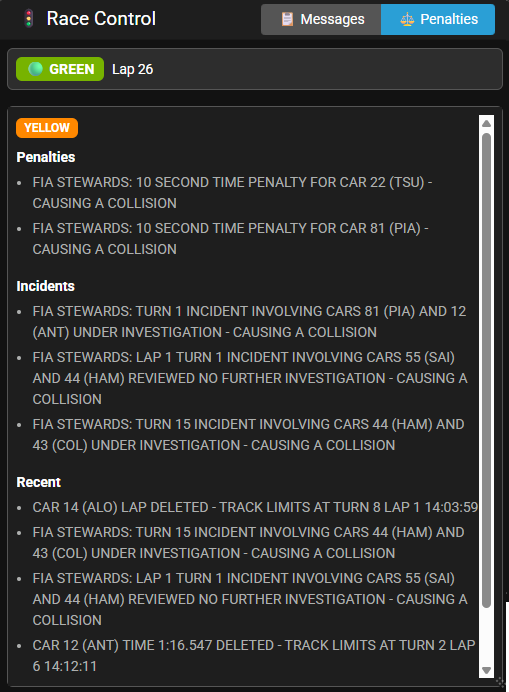
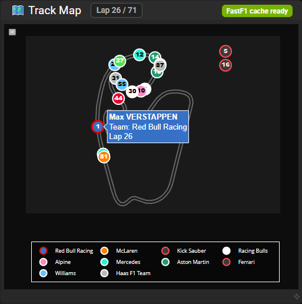
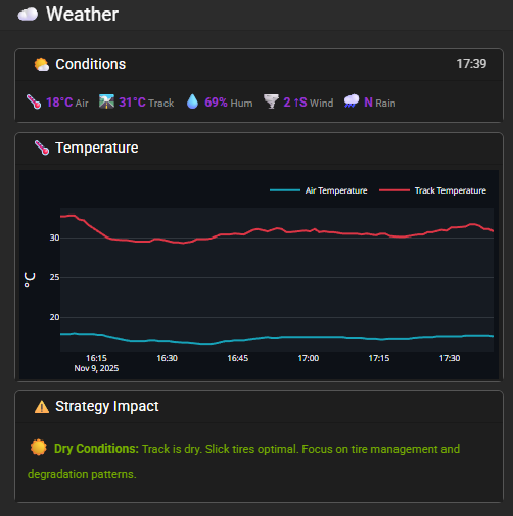
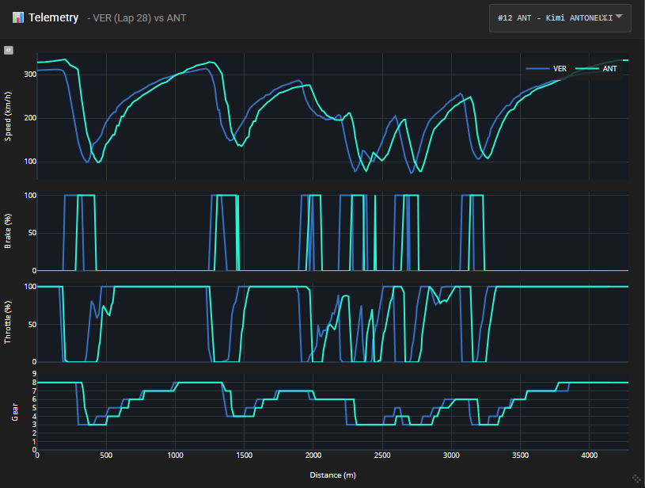

# F1 Strategist AI User Manual

## Introduction

F1 Strategist AI combines multi-dashboard analytics with proactive AI support to help you study Formula 1 sessions in real time or through historical simulation. This manual explains how to launch the Dash application, configure the data context, navigate the sidebar controls, and operate each dashboard. It also covers document knowledge base management, cache operations, and recommended troubleshooting steps.

## Launching the Application

### Prerequisites

- Python 3.11 or later with virtual environment support.
- All Python dependencies listed in requirements.txt.
- Optional API keys: Anthropic Claude, Google Gemini, OpenF1. The app still runs without keys but AI output will be limited.
- FastF1 cache warmed for the sessions you want to replay (handled automatically after the first load).

### Initial Setup

1. Create and activate a virtual environment.
2. Install dependencies using pip install -r requirements.txt.
3. Populate config/.env with any API keys you plan to use.
4. (Optional) Preload caches with scripts/convert_fastf1_cache.py or scripts/preload_season.py when you want offline-ready data.

### Starting the Dash App

- Windows: run run_app.bat (standard) or run_app_debug.bat (verbose logging).
- macOS/Linux: run run_app.sh.
- PowerShell: run run_app.ps1 if you prefer a profile-aware startup.

The server listens on http://127.0.0.1:8501 by default. Open the URL in a desktop browser and keep the terminal open while you work.

## Layout Overview

The interface has a persistent sidebar to the left and a dynamic dashboard grid on the right. Dashboards can be stacked or arranged side by side depending on your selection.

_Main screen with all dashboards visible. Capture once a session is loaded and playback is running._

## Sidebar Navigation

The sidebar is divided into accordion sections. Each panel can stay collapsed once configured to maximize vertical space.

### Mode

- Choose between Simulation and Live mode. Live becomes available automatically when the system detects an active OpenF1 session.
- Simulation mode unlocks playback controls and the Track Map dashboard.
- Manage caches opens a modal to regenerate or delete FastF1 and OpenF1 artifacts for specific sessions.

### Context

- Year: limits meeting options to the selected season.
- Circuit: pick the meeting based on the F1 calendar for the chosen year. Recent races auto-select when available.
- Session: choose practice, qualifying, sprint, or race. The Race Overview dashboard stays available regardless of other selections.
- Driver: sets the focus driver used by AI analyses, telemetry, and certain highlights. Options populate after circuit selection.

### Dashboards

- Check or uncheck dashboards to include them in the main grid. Race Overview is required in both modes.
- Track Map can only be toggled on when the FastF1 cache for the selected session is ready; the label indicates availability.
- Your selection persists between sessions.

### Playback

- Available in Simulation mode. Controls include play/pause, restart, lap step backward/forward, and a speed slider from 1x to 10x.
- A status line shows elapsed simulation time when the interval timer is active.

### RAG Documents

- Status indicator shows whether the knowledge base is loaded and how many documents are available.
- Category lists (Global, Strategy, Weather, Performance, Race Control, Positions, FIA Regulations) display indexed files.
- ➕ buttons open the upload dialog; the app accepts PDF, DOCX, and Markdown up to 10 MB.
- Reload refreshes document lists after manual changes on disk.
- Generate creates circuit-specific templates using historical data and prompts you to confirm overwriting existing files.
- Document entries include edit and delete actions that open the editor modal or remove files after confirmation.

### Configuration

- Update stored API keys for Claude, Gemini, and OpenF1, then save to persist them in config/.env.
- LLM provider selector forces the conversation router to Hybrid (automatic), Claude only, or Gemini only.
- Data sources summary shows current cache and vector store locations for quick reference.

### Help

- The Help button opens a modal with quick start tips, dashboard summaries, AI usage notes, and troubleshooting guidance.

## Dashboards

Dashboards are rendered in the order configured in the dashboard selector. Each card updates automatically based on simulation time or live data.

### AI Assistant

_After capturing, highlight a pit-window alert and a user query reply._

- Displays proactive alerts (amber) triggered by race event detection, assistant answers (gray), and user prompts (blue).
- Quick action buttons (Pit, Weather, Gaps, Predict) enqueue curated prompts without typing.
- Clear resets the conversation history. Use the focus driver badge to verify who the assistant considers primary.
- The panel respects playback state: in Simulation it only sees data up to the active lap to avoid spoilers.

### Race Overview

_Show the full leaderboard, gaps, stints, and pit stop columns._

- Real-time leaderboard with gap to leader, gap to car ahead, tire compound, stint length, and pit stop count.
- Uses OpenF1 intervals and stints endpoints, filtered to the current simulation timestamp.
- Highlights the focused driver and marks retirees with official status codes instead of gap data.
- Pit probability column appears when predictive agents are active for the focused driver.

### Race Control

_Include an example with a Safety Car message and a driver-specific penalty._

- Status header shows the current flag, lap number, and Safety Car or Virtual Safety Car annotation.
- Timeline lists recent race control messages, coloring alerts by severity. Messages involving the focused driver are highlighted.
- Summary panel (beneath the timeline) aggregates active investigations, penalties, and race direction notes.

### Track Map

_Capture a screenshot during simulation playback with driver markers and at least one retired car._

- Requires Simulation mode and a valid FastF1 cache. Once ready, the dashboard animates driver positions per lap.
- Driver markers use team colors and show driver abbreviations; the focused driver gains a red outline.
- Retired cars move to an off-track stack with status annotations but keep hover details from their final telemetry sample.
- Buttons in the header let you reset zoom or refresh trajectories if playback desynchronizes.

### Weather

_Show current metrics plus the temperature trend chart._

- Current conditions panel summarizes air and track temperature, humidity, wind speed/direction, and rainfall flag.
- Temperature graph plots air and track temperatures over time with a “Now” marker aligned with simulation time.
- Strategy impact panel lists AI-generated recommendations such as tire warm-up risks or degradation warnings.

### Telemetry

_Capture overlapping traces for two drivers to demonstrate comparison mode._

- Generates speed, throttle, brake, gear, and DRS traces for the focus driver’s latest completed lap.
- Comparison dropdown lets you overlay a second driver’s lap when available.
- Graph uses distance as the X-axis for lap alignment and marks DRS activation zones in the speed plot.
- Reset view button restores the default camera after manual zooming.

## Knowledge Base Management

1. Press a ➕ button in RAG Documents to open the upload modal.
2. Review detected metadata, adjust the category or filename, and preview converted content if desired.
3. Confirm the upload to index the document in ChromaDB. The status message updates when indexing finishes.
4. Use the pencil icon next to a document to edit it in the embedded markdown editor and save changes back to disk.
5. Delete removes the document from both storage and the vector store after a confirmation prompt.

## Cache Management Workflow

1. Click Manage caches from the Mode accordion.
2. Select year, circuit, session, and cache artifact types (session, telemetry, vectorized data, etc.).
3. Regenerate rebuilds all selected artifacts from scratch. Generate missing only fills absent files. Delete removes cached files so the next session load fetches fresh data.
4. Monitor progress via the summary table, progress bar, and status messages. Close the modal when complete.

## Typical Race Analysis Flow

1. Choose Simulation mode and pick year, circuit, session, and focus driver.
2. Ensure desired dashboards are enabled, then press Play in the Playback section.
3. Monitor Race Overview and Race Control for situational awareness.
4. Consult the AI Assistant for strategy questions or to interpret alerts.
5. Use Telemetry and Track Map for deeper dive comparisons when a stint transition occurs.
6. Review Weather insights before planning pit stops, and run RAG document searches if regulations or historical notes are required.

## Troubleshooting and Tips

- If dashboards remain blank, verify that the session cache finished loading and the sidebar indicates a valid selection.
- Track Map unavailable: open Manage caches and regenerate FastF1 telemetry for the target session.
- AI responses failing: re-enter API keys and ensure you have internet connectivity.
- Telemetry gaps: restart playback to re-sync the simulation timer or lower playback speed for heavy sessions.
- Use Reload in RAG Documents after adding files directly to the data/rag directories.

## Screenshot Checklist

| Screenshot | Suggested Path | Context to Capture |
|------------|----------------|--------------------|
| Main Layout Overview | images/manual/main-layout-overview.png | All dashboards visible during playback |
| AI Assistant Chat | images/manual/ai-assistant-chat.png | Alert plus assistant answer in the feed |
| Race Overview Leaderboard | images/manual/race-overview-leaderboard.png | Full table with tire and stint data |
| Race Control Timeline | images/manual/race-control-timeline.png | Safety Car or penalty message highlighted |
| Track Map Dashboard | images/manual/track-map-dashboard.png | Markers on circuit and retired stack |
| Weather Dashboard | images/manual/weather-dashboard.png | Conditions panel and temperature graph |
| Telemetry Comparison | images/manual/telemetry-comparison.png | Two-driver overlay with DRS bands |

Save the captures using the suggested filenames so the Markdown links resolve automatically.
